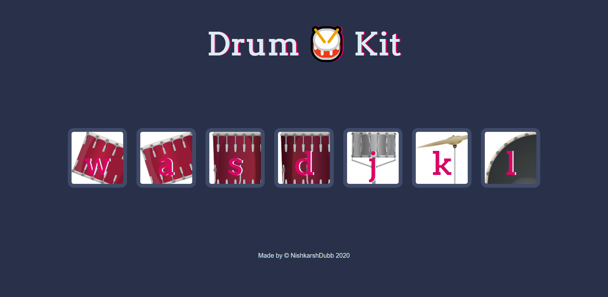

# drumKit-Project

The point of this project is to have each key, when pressed, make a corresponding drum noise. It also uses CSS transitions and animations to make the project more interactive to the user.

## Author 
> Nishkarsh01

## Screenshots 📷

## Live Demo 

 [https://nishkarsh01.github.io/drumKit-Project/](https://nishkarsh01.github.io/drumKit-Project/)
 
 ## Developed Using 💻

+ [Html](https://developer.mozilla.org/en-US/docs/Web/HTML)
+ [Css](https://developer.mozilla.org/en-US/docs/Web/CSS)
+ [Javascript](https://developer.mozilla.org/en-US/docs/Web/javascript)

## Installation or Getting Started

Run the following command in the terminal:

	git clone https://github.com/Nishkarsh01/drumKit-Project.git
or download the zip file from github.
    

## Usage
After extracting the files,

    cd drumKit-Project
    and simply, open the index.html file

## Collaborate
To collaborate, reach me on [nishdubb11@gmail.com]()

## Further help/Reference

+ [MDN Web Docs](https://developer.mozilla.org/en-US/)
+ [w3schools.com](https://www.w3schools.com/)
    

